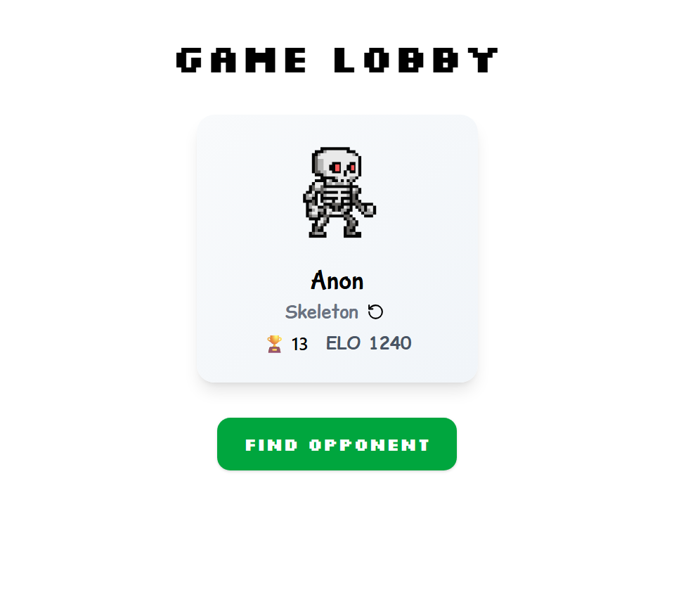

# Trividuel

trivia dueling webgame on a 1v1 setting. Python fastapi backend and React.js frontend. We want to create an online game where people can learn whilst adding a bit of competitive spice.

>_**Our Mission**: to create an online that encourages curiosity and learning of science, technology, cultures, geography._


Private repository as of now.




# Backend 

## Set Up

```bash
# create venv
cd backend/
python3 -m venv venv 
pip install poetry
poetry install --no-root
```

to start:
```bash
cd backend/     # if you haven't already
source venv/bin/activate

bash scripts/start.sh
```
Or alternatively, to start a test environment and use the testers tokens
```bash
bash scripts/start.sh --test
```
The testers token for websocket as below: <br>
`1234567890 -> {"uid": "1234567890", "name": "Tester"}` <br>
`0987654321 -> {"uid": "0987654321", "name": "Tester"}`<br>
insert these tokens in the query eg `/me?token=1234567890` to test as a Tester.

## Development - Linting

```bash
poetry install --with dev
sh scripts/lint.sh
```
## Development - Testing
```bash
sh scripts/test.sh <optinonal_path>
```
If everything set up correctly, the test should all pass.


# Frontend

## Set Up

set up:
```bash
cd frontend/
npm i
```
cause its using vite:
```bash
cd frontend/    # if you haven't already
npm run dev
```

## Frontend Development

all css should be in `styles/`


# Data Prep

This folder is a jupyter notebook environment for preparing and consolidating trividuel questions.

`data_prep/question_preparation.ipynb`

All CSVs in `chosen/` are used to create the final dataset for backend. `arhive/` stores the others datasets that are not chosen.

We encourage datasets rich with knowledge diversity and explores in science, mathematics, general knowledge, geography, culture and religion around the globe.

The dataset should not be limited to one specific culture and domain.


## React + Vite

This template provides a minimal setup to get React working in Vite with HMR and some ESLint rules.

Currently, two official plugins are available:

- [@vitejs/plugin-react](https://github.com/vitejs/vite-plugin-react/blob/main/packages/plugin-react) uses [Babel](https://babeljs.io/) for Fast Refresh
- [@vitejs/plugin-react-swc](https://github.com/vitejs/vite-plugin-react/blob/main/packages/plugin-react-swc) uses [SWC](https://swc.rs/) for Fast Refresh


# Contribution

request Reagan Chan <rrr.chanhiulok@gmail.com> for more info